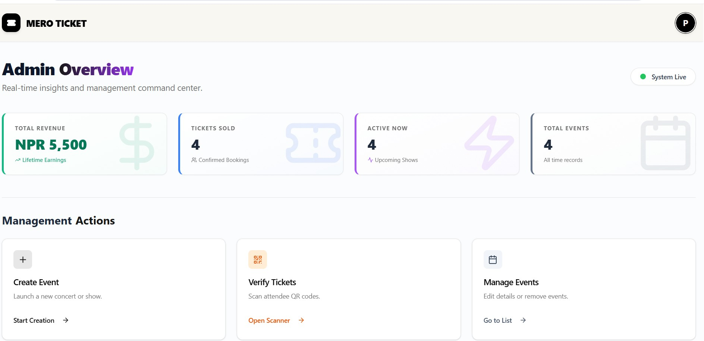
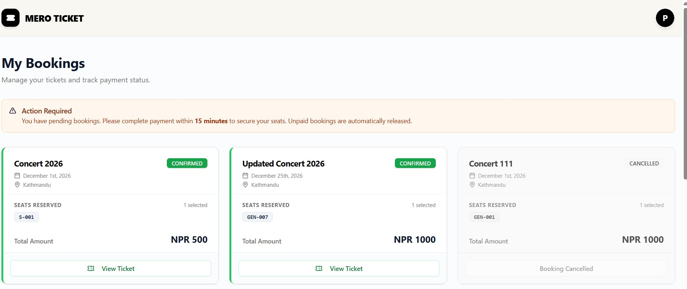
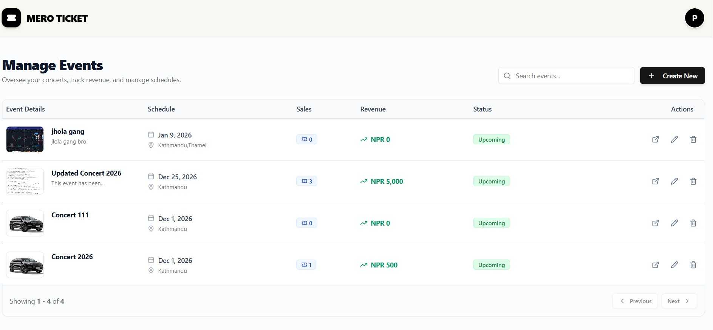
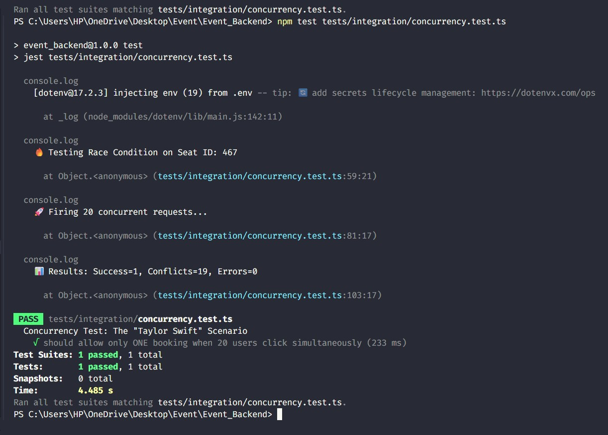
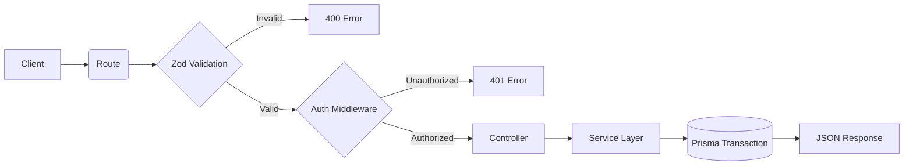

<div align="center">

# 🎟️ Event Management & Ticket Booking System (Backend)
### High-Concurrency Backend | TypeScript | Prisma | PostgreSQL

A production-ready backend for event booking platforms (concerts, conferences, shows).
Focusing on **transactional safety**, **seat locking**, and **secure authentication**.

[Node.js](https://nodejs.org/) • [TypeScript](https://www.typescriptlang.org/) • [Prisma](https://www.prisma.io/) • [PostgreSQL](https://www.postgresql.org/) • [Docker](https://www.docker.com/)

</div>

📸 System Previews
<div align="center">
<h3>🏠 Landing & Home Page</h3>
  
<table>
  <tr>
    <td align="center">
      <b>Admin Dashboard</b><br/>
      
    </td>
    <td align="center">
      <b>Booking Management</b><br/>
      
    </td>
  </tr>

  <tr>
    <td align="center" colspan="2">
      <b>Event Management</b><br/>
      
    </td>
  </tr>

  <tr>
    <td align="center" colspan="2">
      <b>Concurrency Booking Testing</b><br/>
      
    </td>
  </tr>
</table>

</div>
---

## 🚀 Key Features

### 🔒 **High Concurrency & Integrity**
*   **Race Condition Prevention:** atomic transactions utilizing Prisma `interactiveTransactions`.
*   **Seat Locking:** Prevents double-booking via optimistic concurrency control.
*   **Atomic Operations:** Booking and payment status updates happen in a single database transaction.

### 🛡️ **Security First**
*   **Dual Token Auth:** JWT Access Tokens (short-lived) + **HttpOnly** Refresh Tokens.
*   **RBAC:** Strict Role-Based Access Control (`USER`, `ORGANIZER`, `ADMIN`).
*   **Secure Headers:** Helmet integration and XSS protection.

### ✅ **Validation-First Architecture**
*   **Zod Integration:** Runtime and compile-time data validation.
*   **Middleware Guard:** Invalid data is blocked *before* reaching the controller layer.

### 🧱 **Clean Architecture**
*   **Separation of Concerns:** Thin Controllers ➡️ Service Layer ➡️ Data Access.
*   **Centralized Error Handling:** Uniform error responses across the API.

---

## 🧰 Tech Stack

| Component | Technology |
| :--- | :--- |
| **Runtime** | Node.js v20+ |
| **Language** | TypeScript (Strict Mode) |
| **Framework** | Express.js |
| **Database** | PostgreSQL |
| **ORM** | Prisma v5+ |
| **Validation** | Zod |
| **Auth** | JWT (Access + Refresh) |
| **Container** | Docker & Docker Compose |

---

## 📁 Project Structure

A clean, modular structure designed for scalability.

```text
Event_Backend/
├── prisma/
│   └── schema.prisma        # Database Schema & Models
├── src/
│   ├── config/              # Environment & App Configuration
│   ├── controllers/         # Request Handlers (Input/Output)
│   ├── middlewares/         # Auth, Validation, Error Handling
│   ├── routes/              # API Route Definitions
│   ├── services/            # Core Business Logic
│   ├── utils/               # Helper Functions & Constants
│   ├── validators/          # Zod Schemas (Request Validation)
│   ├── types/               # TypeScript Type Augmentations
│   ├── app.ts               # Express App Setup
│   └── server.ts            # Entry Point
├── .env.example             # Environment Variables Template
├── docker-compose.yml       # Database & Service Orchestration
├── Dockerfile               # Production Image Build
└── package.json             # Dependencies
```

### 🔄 Request Lifecycle
Data flows through a strict validation pipeline before reaching business logic.



---

## 🧠 Concurrency & Seat Locking

To handle multiple users trying to book the same seat simultaneously, we use Prisma Transactions. This ensures an "all-or-nothing" execution.

```typescript
// src/services/booking.service.ts

await prisma.$transaction(async (tx) => {
  // 1. Lock & Validate Seats
  const seats = await tx.seat.findMany({
    where: { 
      id: { in: seatIds }, 
      status: 'AVAILABLE' 
    },
  });

  if (seats.length !== seatIds.length) {
    throw new AppError('One or more seats are no longer available', 409);
  }

  // 2. Create Booking
  const booking = await tx.booking.create({
    data: { userId, eventId, totalAmount },
  });

  // 3. Update Seat Status
  await tx.seat.updateMany({
    where: { id: { in: seatIds } },
    data: { status: 'BOOKED' },
  });

  return booking;
});
```

### 🧪 Validation Example (Zod)
We define schemas separate from controllers to keep logic clean.

**1. Define Schema**
```typescript
// src/validators/booking.schema.ts
export const createBookingSchema = z.object({
  body: z.object({
    eventId: z.number({ required_error: "Event ID is required" }),
    seatIds: z.array(z.number()).min(1, "Select at least one seat"),
  }),
});
```

**2. Apply Middleware**
```typescript
// src/routes/booking.routes.ts
router.post(
  '/',
  protect,                        // 1. Check Auth
  validate(createBookingSchema),  // 2. Validate Body
  bookingController.createBooking // 3. Execute Logic
);
```

---

## ▶️ Getting Started

### Prerequisites
*   Node.js v20+
*   Docker & Docker Compose

### Installation

1. **Clone the repository**
   ```bash
   git clone https://github.com/khatiwadaprajwal/EventManagement.git
   cd event-backend
   ```

2. **Install dependencies**
   ```bash
   npm install
   ```

3. **Setup Environment**
   ```bash
   cp .env.example .env
   # Update DB credentials in .env
   ```

4. **Start Database (Docker)**
   ```bash
   docker-compose up -d
   ```

5. **Run Migrations**
   ```bash
   npx prisma migrate dev --name init
   npx prisma generate
   ```

6. **Start Server**
   ```bash
   npm run dev
   ```
   Server running on: `http://localhost:8000`

---

### 🔐 Authentication Flow
*   **Login:** User receives an `accessToken` (JSON) and `refreshToken` (HttpOnly Cookie).
*   **Access:** Bearer Token sent in `Authorization` header.
*   **Refresh:** When Access Token expires, the `/refresh` endpoint uses the HttpOnly cookie to issue a new pair.
